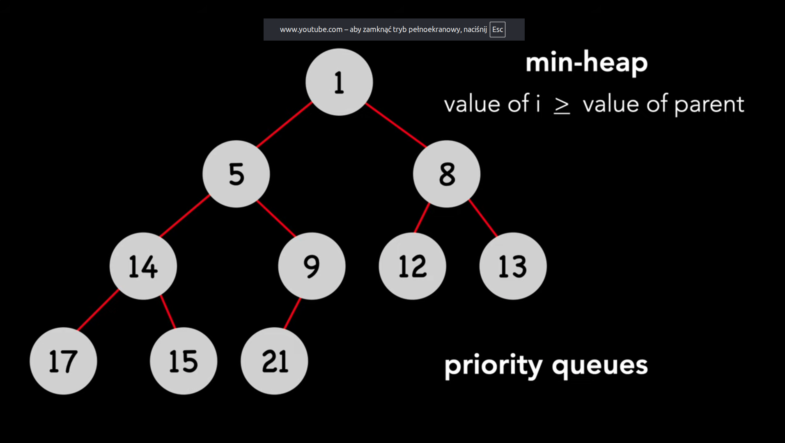
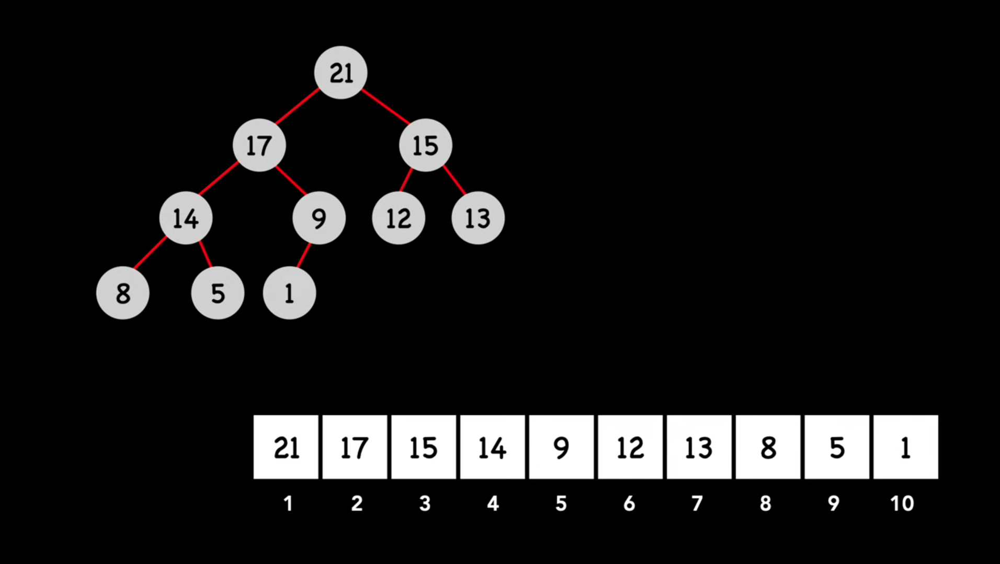

Zadanie to najlepiej rozwiązać za pomocą **kopca binarnego typu min** (ang. **min-heap**). 

https://www.youtube.com/shorts/V8QD98eONCw

średnie materiały [TY list - Michael Sambol - Sterty.](https://www.youtube.com/watch?v=pAU21g-jBiE&list=PL9xmBV_5YoZNsyqgPW-DNwUeT8F8uhWc6)

przydatne [short objaśniający jak działa heapify](https://www.youtube.com/shorts/4NYk5vW_5yc)





[Heap (Eng Wiki)](https://en.wikipedia.org/wiki/Heap_(data_structure))

fajna animacja w [Sortowanie_przez_kopcowanie](https://pl.wikipedia.org/wiki/Sortowanie_przez_kopcowanie)

[trash! Kolejka_priorytetowa](https://pl.wikipedia.org/wiki/Kolejka_priorytetowa)

---

### 1. Struktura danych i indeksowanie

Używamy `std::vector<int>`, aby reprezentować drzewo binarne w sposób liniowy. Dla elementu o indeksie `i`:

* **Lewe dziecko**: `2 * i + 1`
* **Prawe dziecko**: `2 * i + 2`
* **Rodzic**: `(i - 1) / 2`

### 2. Metoda `isEmpty()`

To najprostszy krok. Wystarczy sprawdzić, czy wewnętrzny wektor jest pusty, korzystając z wbudowanej metody `empty()`.

### 3. Metoda `enqueue(int x)` (Wstawianie)

Aby zachować strukturę kopca i uzyskać złożoność O(logN):

1. Dodaj element `x` na sam koniec wektora.
2. Wykonaj operację **"naprawy w górę"** (często nazywaną `heapifyUp` lub `bubbleUp`):
* Porównaj nowy element z jego rodzicem.
* Jeśli nowy element jest **mniejszy** od rodzica, zamień je miejscami.
* Powtarzaj, dopóki element nie znajdzie się w korzeniu lub jego rodzic nie będzie mniejszy.


### 4. Metoda `dequeue()` (Usuwanie najmniejszego)

Najmniejszy element w min-kopcu zawsze znajduje się na samym początku wektora (indeks `0`). Aby go usunąć i zachować strukturę:

1. Zapisz wartość z indeksu `0`, aby móc ją zwrócić na końcu.
2. Przenieś **ostatni** element wektora na miejsce pierwszego (indeks `0`).
3. Usuń ostatni element z wektora (metodą `pop_back()`).
4. Wykonaj operację **"naprawy w dół"** (często nazywaną `heapifyDown` lub `bubbleDown`):
* Zacznij od korzenia (indeks `0`).
* Znajdź mniejsze z dwójki dzieci.
* Jeśli to dziecko jest mniejsze od aktualnego elementu, zamień je miejscami.
* Powtarzaj proces w dół drzewa, aż element będzie mniejszy od swoich dzieci lub stanie się liściem.


---

### Implementacja

```cpp
#include <vector>
#include <algorithm>

class MinPriorityQueue {
private:
    std::vector<int> heap;

    void heapifyUp(int index) {
        while (index > 0) {
            int parent = (index - 1) / 2;
            if (heap[index] < heap[parent]) {
                std::swap(heap[index], heap[parent]);
                index = parent;
            } else break;
        }
    }

    void heapifyDown(int index) {
        int size = heap.size();
        while (true) {
            int smallest = index;
            int left = 2 * index + 1;
            int right = 2 * index + 2;

            if (left < size && heap[left] < heap[smallest]) smallest = left;
            if (right < size && heap[right] < heap[smallest]) smallest = right;

            if (smallest != index) {
                std::swap(heap[index], heap[smallest]);
                index = smallest;
            } else break;
        }
    }

public:
    bool isEmpty() {
        return heap.empty();
    }

    void enqueue(int x) {
        heap.push_back(x);
        heapifyUp(heap.size() - 1);
    }

    int dequeue() {
        // Zakładamy, że kolejka nie jest pusta
        int minVal = heap[0];
        heap[0] = heap.back();
        heap.pop_back();
        
        if (!heap.empty()) {
            heapifyDown(0);
        }
        return minVal;
    }
};

```