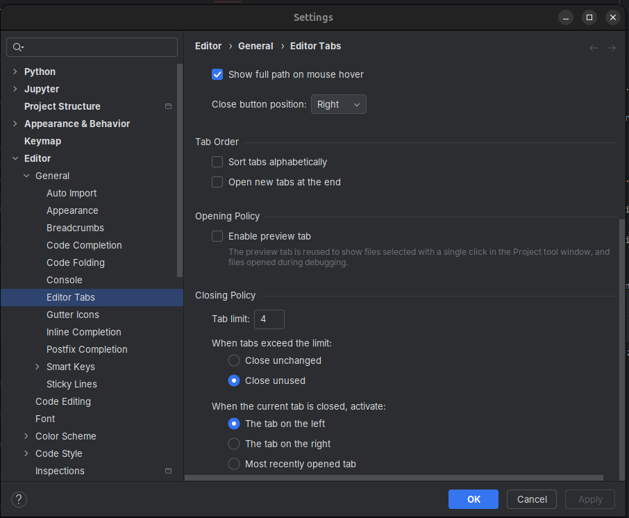

## Ogólne obserwacje
- Zasugerowano ograniczenie liczby otwartych kart w edytorze (ustawienie -> Editor -> Editor Tabs -> Tab Limit) 

## Praktyki uruchamiania i struktura aplikacji
- Zalecane jest stosowanie konstrukcji funkcji `main()` i wywoływanie jej w bloku `if __name__ == "__main__"`.
- Zalecane rozdzielenie odpowiedzialności w kodzie (mniejsze moduły/klasy zamiast jednego dużego pliku).

## Omówione WorkHourApp klasy i podział odpowiedzialności
- Aplikacja została rozdzielona na klasy: WorkHourApp, Database, TaskManager, Timer.
- Klasa Database odpowiada za tworzenie i utrzymanie bazy danych oraz operacje na danych.
- TaskManager zarządza operacjami na zadaniach i komunikuje się z bazą danych (przekazywanie instancji DB jako parametru konstruktora).
- Timer zarządza zarządzaniem przedziałami czasowymi (timespans) i zapisem ich do bazy danych (przekazywanie instancji DB jako parametru konstruktora).
- Wskazano, że taki podział ułatwia testowanie i utrzymanie kodu (np. plik demo służy do tworzenia testowych danych bez uruchamiania GUI).
- tu nadmienię że dobrze jest mieć dostęp do WSZYSTKICH funkcji programu w taki sposób aby nie musieć polegać na `GUI` (sprawdź w słowniku). 
  Nasz kod na to pozwala - żadna klasa oprócz WorkHaurApp nie importuje ani nie korzysta z tinkera (biblioteki do tworzenia GUI).

## GUI (Tk / Tkinter)
- Utworzona jest instancja TK (główne okno) i do niej dodawane są widgety: label, frame, treeview itp.
- Widgety są tworzone i przypisywane do atrybutów (`self.time_label` itd.), aby mogły być używane w innych metodach klasy.
- Parametry układu (sticky, columnspan, padx/pady) decydują o rozmieszczeniu widgetów.
- Mechanizm aktualizacji timera opiera się o wywołania po czasie (np. after 1000 ms), dzięki czemu funkcja samowywołuje się co sekundę.
- Zwrócono uwagę na możliwą nieefektywność: timer tickuje nawet gdy nie jest w stanie aktywnym (możliwość optymalizacji).
- Funkcja wyświetlania wyboru zadania (showTaskSelectionDialog) może blokować wykonanie aż do uzyskania wyboru (modalny dialog).

## Praca z Git / workflow
- Omówiono operacje: fetch, pull, checkout, merge oraz rozwiązywanie konfliktów (accept left / accept right, ręczne łączenie zmian).
- Pokazano sposób przeglądania zmian w commitach (zaznaczanie kilku commitów i podgląd zmienionych plików).
- Wskazano użyteczne widoki: collapse unchanged (ukrycie niezmienionych fragmentów) do skupienia się na różnicach.
- Zwrócono uwagę na poprawne zarządzanie branchami (checkout na lokalny main vs origin/main) oraz konsekwencje wielokrotnego modyfikowania tych samych plików.

## Narzędzia i skróty
- Zalecane użycie przycisków myszy "back/forward" do nawigacji po ostatnio odwiedzanych miejscach w kodzie jako wygodną alternatywę skrótów klawiszowych.
- Wymieniono użyte skróty do odświeżania informacji o zdalnych zmianach (fetch itp.).

## Angielskie słowa/wyrażenia (słowo — tłumaczenie — zastosowanie)

- Notebook — Notatnik — (Jupyter Notebook) tworzenie i uruchamianie komórek kodu i dokumentacji (analiza danych, eksperymenty, wykresy).
- cursor pattern — wzorzec kursora — sposób iterowania po wynikach zapytań/strumieni danych
- tuple — krotka — niemutowalna sekwencja w Pythonie (np. wynik zapytania zwracający wiersz jako krotkę).
- Database — baza danych — system przechowywania danych (SQLite/Postgres; operacje CRUD, migracje).

- GUI (graphical user interface) — Graficzny interfejs użytkownika
- Task — zadanie — Często nazywamy tak pojedyńcza aplikację.
- Manager — menedżer — komponent zarządzający obiektami/operacjami (np. TaskManager zarządza zadaniami).
- timespan / timespans — przedział czasowy
- stack trace — ślad stosu — wypis błędu pokazujący sekwencję wywołań prowadzących do wyjątku (przydatne przy debugowaniu).

- frame — rama — kontener widgetów w GUI (Tkinter Frame, grupowanie elementów).
- sticky — lepki/klejący/czepliwy - parametr grid w Tkinter określający przyciąganie do krawędzi (N, S, E, W).
- after — po — metoda Tkinter (tkInstance.after(ms, func)) która wykona funkcję `func` po zadanym czasie. Wiele języków i bibliotek używa tego słowa w tym celu.
- label — etykieta — widget GUI wyświetlający tekst (Tkinter Label).
- tree view — widok drzewa — przedstawienie hierarchii (struktur plików lub elementów GUI; Tkinter Treeview).

- branch — gałąź — w gicie gałąź to niejako alternatywna historia z filmów sci-fi.
  Gdzieś się rozgałęzia od głównego wątku i zmiany tam wprowadzone nie wpływają na to dzieje się w innych branchach.
  No chyba że któregoś dnia nastąpi kataklizm zderzenia, połączenia dwóch światów (merge). (PS: Liczę, że pochwalisz moją kreatywność)
- to fetch — pobrać — w Git: pobranie zmian z remote bez scalania; w DB: pobranie wierszy z kursora (fetchone/fetchall).
- to merge — scalić — łączenie gałęzi w Git (może tworzyć commit scalający; możliwe konflikty do rozwiązania).
- to pull — ciągnąć — `git pull` pobiera zmiany z remote i próbuje je zmergować do lokalnej gałęzi.
- to push — pchać — git push wysyła lokalne commity na zdalne repo.
- checkout — wymeldować się (np. z Hotelu), finalizuj zamówienie (sklep online), przełącz/wybierz — git checkout zmienia gałąź lub przywraca pliki;
- diff — różnica — pokazuje zmiany między wersjami/commitami/plikami (`git diff`, przegląd zmian).

## Sugestie na dalsze zajęcia / dalsze kroki
- Zoptymalizować mechanizm odświeżania timera, aby nie wykonywał się gdy timer jest zatrzymany.
- Przeprowadzić wspólne ćwiczenie rozwiązywania konfliktów merge w Git na prostym przykładzie.